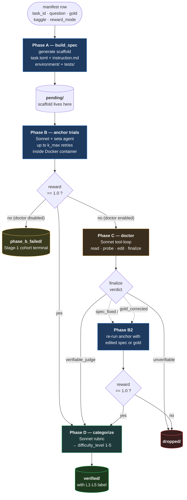
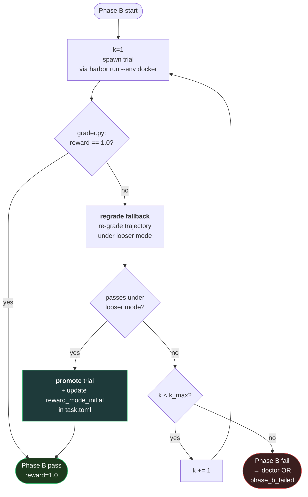
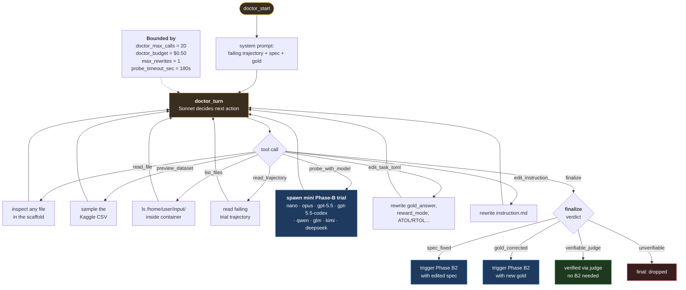
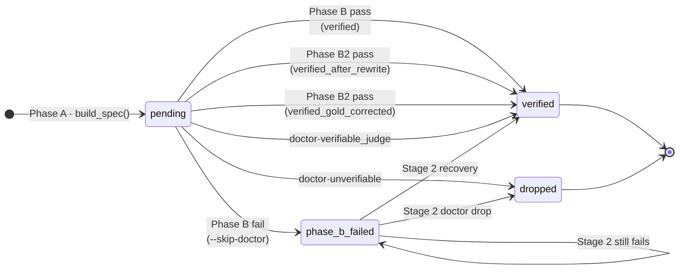
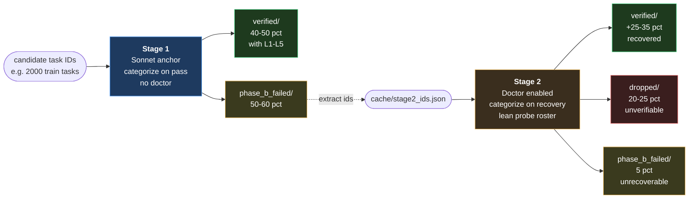
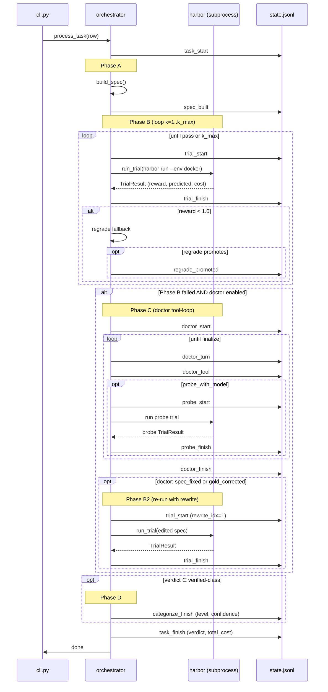
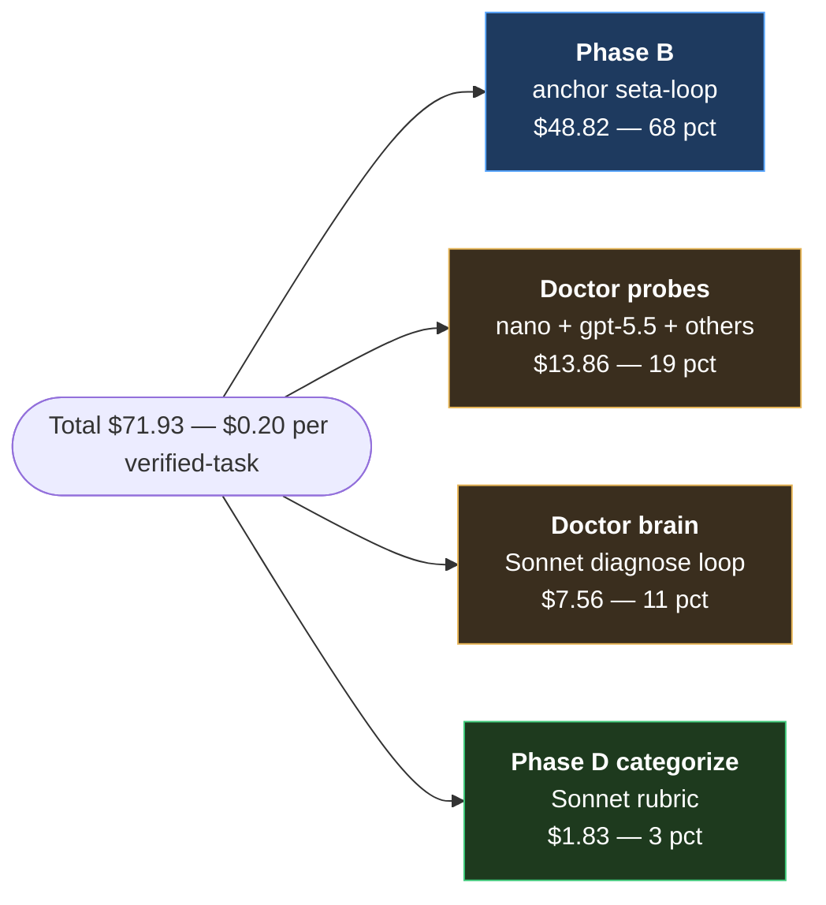

# Pipeline flow — visualized

A picture-first reference for the staged-verification pipeline. Every diagram
below describes one slice of the same system: how a single task gets from
"manifest row" to "verified, with difficulty label" (or to "dropped, with
reason"). Read top-to-bottom for the full mental model, or jump to whichever
diagram answers your question.

All diagrams are Mermaid — they render in GitHub, on Hugging Face dataset
cards, and in any modern Markdown previewer.

---

## 1. One task, end to end

The big picture. Solid arrows are the happy path; dashed are doctor-driven
recovery branches.



---

## 2. Inside Phase B — the retry + regrade loop

`--k-max` retries on flaky LLM behaviour. After each fail, the regrade fallback
re-grades the SAME trajectory under a looser `reward_mode` (e.g. `numeric` →
`flexible` → `llm_judge`) — no new LLM call to the agent, just a cheaper grader.



**Key knobs**
- `--k-max 2` (default) — first attempt + one retry
- `--max-retries-per-trial 1` — per-trial retry on **transient** errors only (SandboxException, 5xx, TimeoutException). Distinct from k-max (which retries on legitimate failure).
- `--regrade-judge-model openai/gpt-5.4-nano` — the cheap LLM judge used by the regrade fallback

---

## 3. Inside Phase C — the doctor

Sonnet (the "doctor brain") gets the failing trajectory, the spec, and the gold,
then emits tool calls **one at a time**. It can run mini-Phase-B trials with
other models to cross-check, edit the spec, or declare the task unverifiable.
A session is bounded by tool-call count, $ budget, and number of allowed rewrites.



**The four finalize verdicts and what they mean**

| Verdict | Doctor's reasoning | Next step |
|---|---|---|
| `spec_fixed` | grader was too strict; e.g. `numeric` should be `flexible` | Phase B2 with the edited `task.toml` |
| `gold_corrected` | multiple probes converged on a NEW answer ≠ original gold | Phase B2 with the new `gold_answer` |
| `verifiable_judge` | LLM judge confirms anchor's predicted answer ≡ gold semantically | skip B2; final verdict = `verifiable_judge` |
| `unverifiable` | probes give inconsistent answers; question is genuinely ambiguous | final verdict = `dropped` |

---

## 4. Scaffold state machine

Each scaffold lives in exactly one folder. The folder *is* the state — by
inspecting `harbor/tasks/<suite>/{pending,verified,dropped,phase_b_failed}/`,
you can see the current verdict for every task without parsing JSONL.



`build.py:_resolve_task_dir()` searches all four folders, so re-runs find the
existing scaffold instead of rebuilding. The folder moves are atomic
(`shutil.move()`) at the end of `process_task()`.

---

## 5. Two-stage workflow on a batch

How you actually use the pipeline in practice. Stage 1 processes the whole
batch cheaply; Stage 2 picks up only the failures from Stage 1.



**Why two stages.** Stage 1 is cheap-and-fast — most tasks Sonnet handles cleanly
go straight to "verified+categorized" without paying for the doctor. Stage 2 is
the targeted-rescue stage — it pays doctor + probe costs only on the residual.
On the 500-task eval the split was:

| Stage | Output | Cost |
|---|---|---|
| Stage 1 | ~50% verified (with difficulty), ~50% phase_b_failed | $0.08 / task |
| Stage 2 | ~60% recovered (verified-class), ~40% dropped or stuck | $0.20 / task in this stage |
| **Combined** | **73% verified end-to-end** | **~$0.20 / verified-task** |

---

## 6. What lands in `state.jsonl` (sequence view)

Every meaningful event during `process_task()` gets one JSONL line. State.jsonl
is the source of truth for live monitoring (the textual stdout log can be
block-buffered; state.jsonl is fsync'd more aggressively).



You can replay/inspect a run by grepping these events:

```bash
# Did this task ever pass?
grep '"task_id": "0000/419/419825.ipynb_qa_1"' runs/*/state.jsonl | grep '"reward": 1'

# What did the doctor decide?
grep '"event": "doctor_finish"' runs/*/state.jsonl | head

# Per-task wall time
python -c "
import json, glob
events = [json.loads(l) for l in open('runs/<ts>/state.jsonl')]
starts = {e['task_id']: e['ts'] for e in events if e['event']=='task_start'}
ends = {e['task_id']: e['ts'] for e in events if e['event']=='task_finish'}
for tid in starts:
    if tid in ends:
        print(tid, ends[tid], '-', starts[tid])
"
```

---

## 7. Where the dollars go

Real numbers from the 500-task eval (combined Stage 1 + Stage 2 + categorize-backfill):



### Average per-task costs (Sonnet anchor + Sonnet doctor)

| What you're paying for | Avg $ | When it fires |
|---|---:|---|
| Phase B trial (one anchor attempt) | **~$0.05–0.10** | Every task in Stage 1; every Stage 2 task does it too |
| Phase B regrade fallback | **~$0.001** | After each failing trial; just an LLM-judge call |
| Phase B2 re-run (after rewrite) | **~$0.05–0.10** | ~10% of Stage 2 tasks (when doctor edits spec or gold) |
| Doctor session (brain + tool calls) | **~$0.02–0.05** | When Phase B fails AND Stage 2 is enabled |
| Doctor probe (one mini-trial via nano/gpt-5.5) | **~$0.03–0.10** | 1-3 probes per doctor session typically |
| Phase D categorize (single rubric call) | **~$0.005** | Every verified-class task |
| **End-to-end avg per task** | **~$0.10–0.15** | Stage 1 alone: ~$0.08 · Stage 2 alone: ~$0.20 |
| **Per verified-class task** | **~$0.20** | $ spent ÷ tasks that ended verified |

### Small concrete example: the 500-task eval run

The full eval — 500 tasks, Stage 1 + Stage 2 on the failures, plus a
post-run L0 backfill — looked like this:

| Phase | Tasks processed | $ spent | Avg $/task | Wall time |
|---|---:|---:|---:|---:|
| Stage 1 on 100 (batch 1) | 100 | $10.84 | $0.11 | 11 min |
| Stage 2 on 51 phase_b_failed | 51 | $10.15 | $0.20 | 23 min |
| Stage 1 on 278 (batch 2: 100 fresh + 173 new + 5 old) | 278 | ~$15 | $0.05 | 37 min |
| Stage 2 on 168 phase_b_failed | 168 | $22.77 | $0.14 | 27 min |
| L0 backfill (re-categorize 27 missing) | 27 | $0.13 | $0.005 | <1 min |
| Categorize-gate fix (catch verifiable_judge in-pipeline) | — | $0.13 | — | — |
| **Total** | **500** (one-shot) | **$71.93** | **$0.14 avg / $0.20 per verified** | **~1.5 hours active** |

End state: **366 verified** (73%), **127 dropped** (25%), **7 phase_b_failed**
residue (1%). All 366 carry an L1-L5 difficulty label.

If you want a quick sanity check that everything's wired right, **a single
L1 task end-to-end costs ~$0.02 with the bash agent + Sonnet** (one Phase B
trial, no doctor, one categorize call). That's the smallest meaningful unit
the pipeline produces.

**Implication.** Phase B is the dominant cost line at ~⅔ of the total.
Making it faster or cheaper (via a cheaper anchor model, smarter k-max,
or better regrade heuristics) moves the needle more than optimising the
doctor. The doctor's cost is split ~64% probes / ~36% brain — and probes ARE
mostly Phase-B-equivalents under different models. So really the "cost of
running an LLM-tool-loop on a Kaggle task" is what we're paying for.

---

## 8. Reading the diagrams in three lines

- **Phase A** = generate scaffold, idempotent.
- **Phase B** = anchor LLM tries the task in Docker, with retries + regrade fallback. If pass → Phase D. If fail → Phase C (or `phase_b_failed/` if doctor disabled).
- **Phase C** = doctor LLM with 8 tools. Can probe other models, edit the spec/gold, declare unverifiable, or judge-confirm. Outcomes route to Phase B2 (re-run) or directly to a final bucket.
- **Phase D** = single rubric call assigns L1-L5 difficulty on verified-class tasks.
